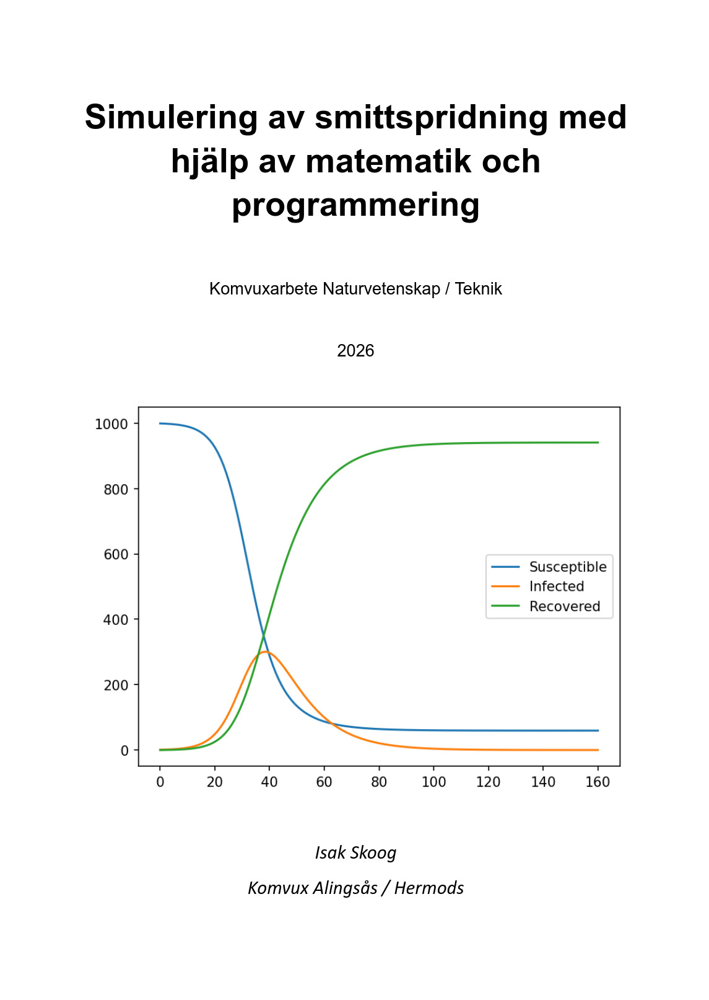
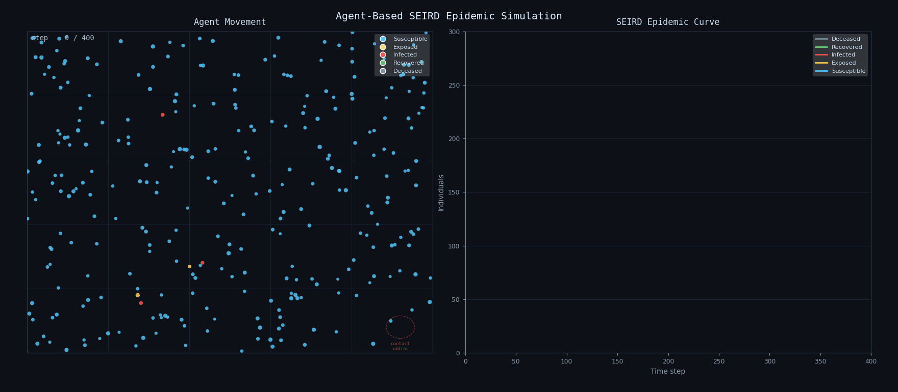
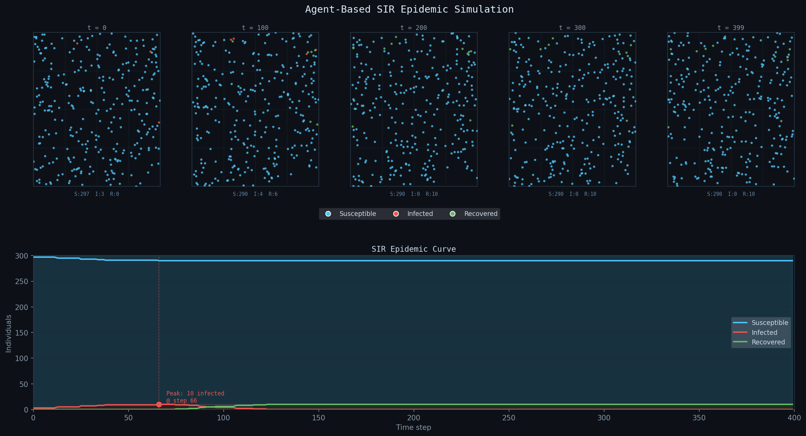
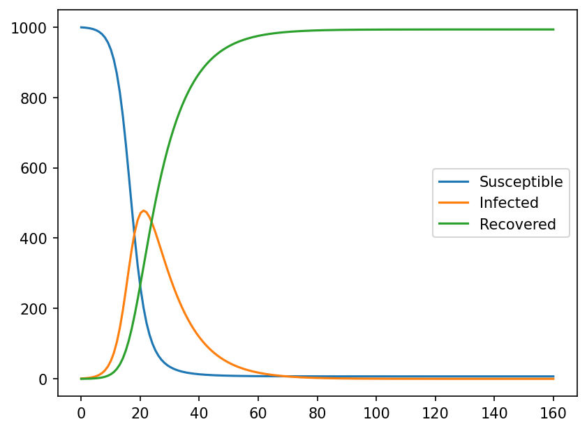
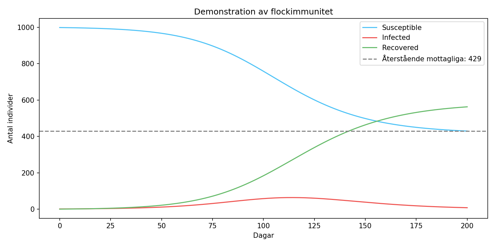
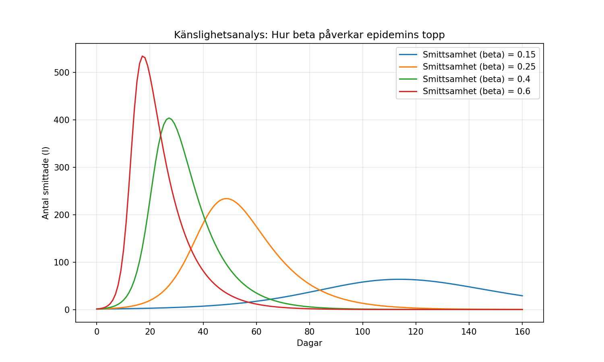
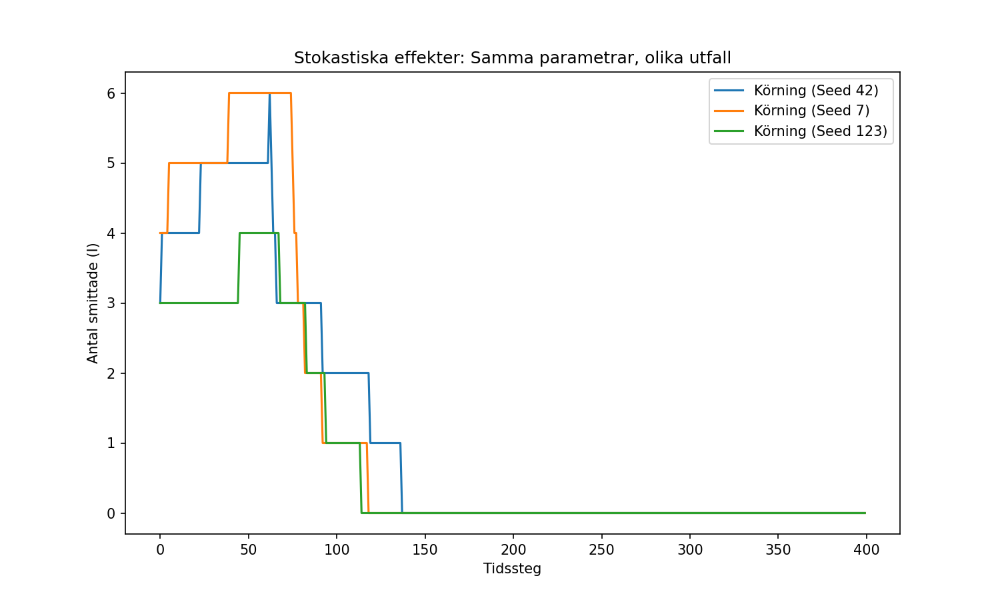
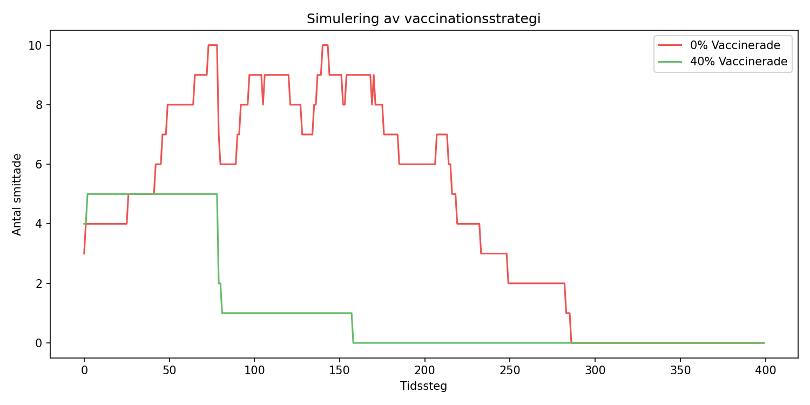

---
# SIR model simulation

### Stochastic ABM (Agent-based model)

### Fundamental Mathematical deterministic model

### Flock immunity

### Sensitivity analysis

### Stochastic variation

### Vaccination simulation

